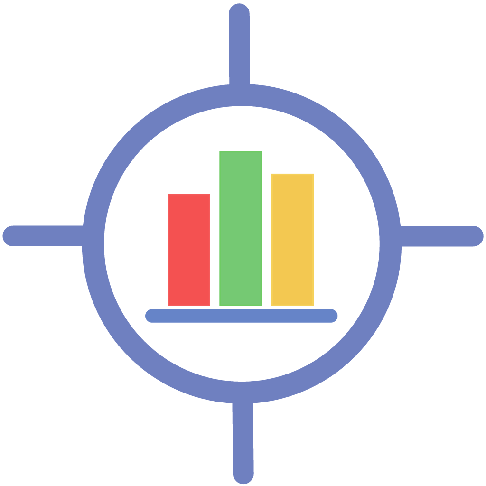

# Welcome to ProjectAble Home Page 

> A Helpful Status Reporting and Forecasting App for iPhone

## What is ProjectAble?
ProjectAble uses a traditional project management technique called Earned Value Analysis to forecast the outcome of the project accurately and reliably.

### Budget Distribution
ProjectAble uses the reporting frequency, start and end dates, and the selected budget distribution curve to spread the project budget accordingly. ProjectAble does this by dividing the duration into quarters and applying rates to each reporting period within each quarter in order to get the right distribution.

### Treatment Of Time
ProjectAble uses time only to calculate the project duration and number of reporting periods. Each time you add a new progress update, ProjectAble calculates the percentage complete and spend for the reporting period. The reporting period is important but ProjectAble doesn't use the current date and time in it's calcultations. When you add the final progress update, ProjectAble will set the percent complete to 100%. As with all progress updates, you can overwrite the pre-calculated values. Setting the percent complete to less than 100% will allow the project to continue but in these circumstances the calculations may behave unexpectedly.

You can use the [editor on GitHub](https://github.com/SnowyAlcazar/aleynmoor/edit/master/index.md) to maintain and preview the content for your website in Markdown files.

Whenever you commit to this repository, GitHub Pages will run [Jekyll](https://jekyllrb.com/) to rebuild the pages in your site, from the content in your Markdown files.

